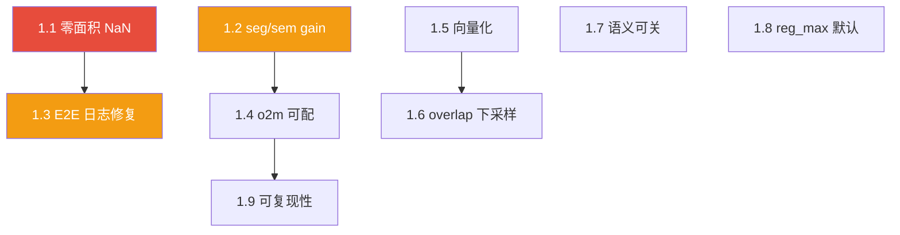

# YOLO26s-seg 训练代码审查报告

> 用途：作为后续改进 plan 的对比基线（baseline）。每条问题含 **位置 / 根因 / 影响 / 改法 / 验证 / 核实** 六要素，并标注严重程度与改动范围，便于评估 plan 是否覆盖、是否引入回归。

- 仓库：ultralytics `8.4.82`
- 审查范围：yolo26-seg 训练链路（模型配置 → 检测头 → 损失 → trainer → 数据）
- 审查日期：2026-06-29
- 最后完善：2026-06-29（补充源码核实、依赖关系、实施注意事项与结论）
- 关键文件：
    - `ultralytics/cfg/models/26/yolo26-seg.yaml`
    - `ultralytics/nn/modules/head.py`（`Segment`、`Segment26`）
    - `ultralytics/nn/modules/block.py`（`Proto`、`Proto26`）
    - `ultralytics/nn/tasks.py`（`SegmentationModel`、`parse_model`）
    - `ultralytics/utils/loss.py`（`v8SegmentationLoss`、`E2ELoss`）
    - `ultralytics/models/yolo/segment/train.py`（`SegmentationTrainer`）
    - `ultralytics/engine/trainer.py`、`ultralytics/engine/model.py`
    - `ultralytics/data/augment.py`（`sem_masks` 生成）
    - `ultralytics/cfg/default.yaml`

---

## 文档方法论

| 维度         | 说明                                                              |
| ------------ | ----------------------------------------------------------------- |
| **定位**     | 问题清单 + 验收标准，可直接驱动 PR 拆分与 plan 对照               |
| **每条结构** | 位置 → 根因 → 影响 → 改法 → 验证 → **核实**（与当前源码对照结论） |
| **风险分级** | P0 正确性 → P1 损失/监控 → P2 性能/显存 → P3 配置/接口            |
| **边界**     | 第 2 节「设计正确点」标明**不应修改**的行为，防止 plan 误伤       |
| **验收**     | 第 8 节检查清单 + 第 7 节建议单测                                 |

---

## 0. 训练链路速览（对照用）

```
YOLO("yolo26s-seg.pt").train(data=...)
 └─ engine/model.py: train() → _smart_load("trainer")  # task_map["segment"]["trainer"]
     └─ models/yolo/segment/train.py: SegmentationTrainer(DetectionTrainer)
         ├─ get_model()  → SegmentationModel(cfg, nc, ch)  # nn/tasks.py:565
         │     └─ parse_model() 解析 yolo26-seg.yaml → backbone+C2PSA + head 末层 Segment26
         └─ get_validator() → SegmentationValidator, loss_names=("box","seg","cls","dfl","sem")

SegmentationModel.loss(batch, preds) → criterion(preds, batch)
 └─ init_criterion(): E2ELoss(self, v8SegmentationLoss)   # end2end=True
     ├─ one2many = v8SegmentationLoss(model, tal_topk=10)
     └─ one2one  = v8SegmentationLoss(model, tal_topk=7, tal_topk2=1)
     每个 v8SegmentationLoss.loss():
         ├─ get_assigned_targets_and_loss()  → box/cls/dfl（含 TaskAlignedAssigner）
         └─ calculate_segmentation_loss()    → seg（BCE, 逐图循环 einsum）
              + sem（Proto26 返回 semantic 时启用 BCEDice）

每 epoch 末: trainer.py:540  unwrap_model(model).criterion.update()  # o2m 衰减
```

模型规模（`yolo26-seg.yaml` `scales`）：`s: [0.50, 0.50, 1024]` → 11.5M 参数, 37.4 GFLOPs。
头：`Segment26(nc, nm=32, npr=256)`，`npr` 经 `parse_model` 按 width 缩放（s → 128）。
Proto26 训练期返回 `(proto, semantic)` 元组（`block.py:2005-2007`），语义辅助头始终启用。

### 0.1 链路核实对照表

| 文档描述                                            | 源码位置               | 核实 |
| --------------------------------------------------- | ---------------------- | ---- |
| `SegmentationModel` → `E2ELoss(v8SegmentationLoss)` | `tasks.py:592-594`     | ✓    |
| o2m/o2o 各一套 loss（topk 10 vs 7/1）               | `loss.py:1179-1180`    | ✓    |
| 每 epoch 末 `criterion.update()`                    | `trainer.py:540-541`   | ✓    |
| Proto26 训练期返回 `(proto, semantic)`              | `block.py:2005-2007`   | ✓    |
| one2one 分支 proto detach                           | `head.py:412-414`      | ✓    |
| `loss_names` 五项顺序                               | `segment/train.py:66`  | ✓    |
| yaml `end2end: True`, `reg_max: 1`                  | `yolo26-seg.yaml:9-10` | ✓    |

---

## 1. 问题清单（按严重程度）

### P0 — 正确性 / 数值稳定性

#### 1.1 零面积 bbox 导致 mask loss NaN

- **位置**：`utils/loss.py:616`、`utils/loss.py:576`、`utils/loss.py:639`
- **代码**：
    ```python
    marea = xyxy2xywh(target_bboxes_normalized)[..., 2:].prod(2)  # 616
    return (crop_mask(loss, xyxy).mean(dim=(1, 2)) / area).sum()  # 576
    return loss / fg_mask.sum()  # 639
    ```
- **根因**：`area = w_norm * h_norm`。当 GT 多边形退化为线/点、或 copy-paste 增强产生 0 宽高框时 `area=0`，`mean/area` → NaN，经 `loss / fg_mask.sum()` 污染整 batch 梯度。
- **影响**：自定义 seg 数据集（自动标注/多边形简化）训练中途突然 NaN。
- **改法**：`marea = ...prod(2).clamp(min=1e-6)`；数据侧可选过滤 `w<1 or h<1` 退化框（增强路径仍需 loss 侧防护）。
- **验证**：构造 `target_bboxes` 含 `[x,y,x,y]` 的用例，断言 loss 有限；coco8-seg 冒烟训练 3 epoch 无 NaN。
- **改动范围**：`utils/loss.py` 1 行 + 数据过滤（可选）。
- **回归风险**：极低（clamp 下界 1e-6 对正常框无影响）。
- **核实**：✓ 问题真实。`fg_mask.sum()==0` 守护（`loss.py:507`）仅防空正样本，**不防** area=0；clamp 为必要修复。

---

### P1 — 损失设计 / 训练监控

#### 1.2 seg / sem 损失复用 `box` 增益，无独立 `seg` 超参

- **位置**：`utils/loss.py:551`、`utils/loss.py:543`；`cfg/default.yaml`（无 `seg:`/`sem:` 项）
- **代码**：
    ```python
    loss[1] *= self.hyp.box  # seg gain  ← 掩码 BCE 借 box 权重
    loss[4] *= self.hyp.box  # sem gain  ← 注释误写为 seg gain（543 行），实为语义辅助 BCEDice
    ```
- **根因**：历史设计无独立 seg/sem gain。YOLO26 recipe `box=9.83`（`docs/en/guides/yolo26-training-recipe.md:117`，v8 默认 7.5），掩码与语义损失均被放大 ~10×。
- **影响**：掩码损失与框回归耦合，无法独立调优；大 box 权重下掩码分支过权，小目标 mask 噪声放大；语义辅助头 ×9.83 偏大。
- **改法**：
    1. `default.yaml` 增加 `seg: 1.0`、`sem: 1.0`；
    2. `loss[1] *= self.hyp.seg`、`loss[4] *= self.hyp.sem`；
    3. 向后兼容：旧 checkpoint 无 `seg`/`sem` 时回退用 `box`（读取 `hyp` 时 fallback）。
- **验证**：分别用 `seg∈{0.5,1,2}` 在小数据集跑，对比 mask AP 与 box AP 解耦程度；确认旧 `.pt` 加载不报 KeyError。
- **改动范围**：`default.yaml` + `utils/loss.py` + `utils/checks.py`(yaml 校验) + 文档。
- **回归风险**：中。需保证默认值等价于旧行为（`seg=box`、`sem=box`），否则会改变所有 seg 模型默认训练曲线。
- **核实**：✓ 问题真实。`default.yaml` 仅 `box: 7.5`；recipe 对 s/m/l/x 使用 `box=9.83`，seg/sem 与 box 强耦合。

#### 1.3 E2ELoss 返回的 detached loss 仅来自 one2one，训练监控失真

- **位置**：`utils/loss.py:1196`
- **代码**：
    ```python
    return loss_one2many[0] * self.o2m + loss_one2one[0] * self.o2o, loss_one2one[1]
    # loss_names=("box_loss","seg_loss","cls_loss","dfl_loss","sem_loss") 只反映 o2o
    ```
- **根因**：标量 loss 是 o2m+o2o 加权合并，但逐分量 detach 只取 one2one[1]。训练初期 `o2m=0.8`，真实 seg/box 损失主要由 o2m 贡献，进度条却只显示 o2o。
- **影响**：调参时据日志判断「seg loss 收敛」会误判；patience/early-stopping 监控量与真实优化目标不一致。
- **改法**：
    ```python
    loss_items = loss_one2many[1] * self.o2m + loss_one2one[1] * self.o2o
    return loss_one2many[0] * self.o2m + loss_one2one[0] * self.o2o, loss_items
    ```
- **验证**：单步前向，断言返回的 loss_items 各分量与标量 loss 加权关系一致；对比日志曲线前后差异。
- **改动范围**：`utils/loss.py` 1 处（`E2ELoss.__call__`，影响 detect/pose/obb/seg/tvp 全部 E2E）。
- **回归风险**：低-中。仅改日志量，不参与梯度；但影响所有 E2E 任务的日志，需同步检查 trainer 对 `loss_items` 维度的假设。
- **核实**：✓ 问题真实。反传用加权标量 loss，日志仅 o2o 分量，监控与优化目标不一致。

#### 1.4 E2ELoss 的 o2m/o2o 权重硬编码，与官方 recipe 不一致

- **位置**：`utils/loss.py:1184-1188`
- **代码**：
    ```python
    self.o2m = 0.8  # 公开包固定 0.8
    self.final_o2m = 0.1  # 衰减终点固定 0.1
    # 官方 yolo26s-seg checkpoint: o2m=0.705
    ```
- **根因**：`muon_w/sgd_w/cls_w/o2m/topk` 写死在 checkpoint，公开包不读取，传给 `train()` 报 invalid-argument（`yolo26-training-recipe.md:244-246` FAQ 明确）。
- **影响**：公开包无法复现官方 mAP；o2m 起点偏高 → 一对多头早期主导 → 一对一（推理用）头收敛偏慢。
- **改法**：`E2ELoss.__init__` 从 `model.args` 读取 `o2m/final_o2m/topk`（即使不进 `default.yaml` 公共项，也允许从 checkpoint `train_args` 继承），缺省回退当前硬编码值。
- **验证**：加载官方 `.pt`，断言 `criterion.o2m == ckpt train_args o2m`；从零训练对比 o2o 头收敛速度。
- **改动范围**：`utils/loss.py` E2ELoss + `nn/tasks.py` init_criterion 传参 + checkpoint 字段白名单。
- **回归风险**：中。需确保不破坏现有 `train_args` 校验逻辑（避免把内部参数当非法参数拒绝）。
- **核实**：✓ 与上游文档一致。属可复现性缺口，非逻辑 bug；与 1.9 同源。

---

### P2 — 性能 / 显存

#### 1.5 `calculate_segmentation_loss` 按图像 Python 循环 + 逐图 einsum

- **位置**：`utils/loss.py:621-633`
- **代码**：
    ```python
    for i, single_i in enumerate(zip(fg_mask, target_gt_idx, pred_masks, proto, mxyxy, marea, masks)):
        ...
        loss += self.single_mask_loss(gt_mask, pred_masks_i[fg_mask_i], proto_i, ...)
    ```
- **根因**：逐图遍历，每图一次 `einsum('in,nhw->ihw')` + `crop_mask`。E2E 下 o2m/o2o 各调一次，recipe batch=128 → 每步 256 次循环。源码注释（`loss.py:604-607`）自承「batch loss 可向量化加速」。
- **影响**：训练吞吐受 CPU 循环拖累，大 batch 明显。
- **改法**：把所有正样本 `(pred_i, proto_i, mxyxy_i, marea_i, gt_mask_i)` 拼成大张量一次性 einsum；或 `torch.vmap`。加开关保留旧路径用于数值对齐。
- **验证**：与旧实现逐 batch 对比 loss 数值（atol/rtol）；benchmark 吞吐提升。
- **改动范围**：`utils/loss.py` `calculate_segmentation_loss` 重写。
- **回归风险**：中。数值必须与旧路径一致（含 `overlap=True/False` 两种）。
- **核实**：✓ 性能瓶颈描述准确。向量化时需保留 DDP dummy loss（`loss.py:635-637`、`546-549`），见第 6 节。

#### 1.6 `overlap=False` 时 proto 双线性上采样到全分辨率

- **位置**：`utils/loss.py:510-512`
- **代码**：
    ```python
    if tuple(masks.shape[-2:]) != (mask_h, mask_w):
        # masks = F.interpolate(masks[None], (mask_h, mask_w), mode="nearest")[0]  # 注释掉的下采样路径
        proto = F.interpolate(proto, masks.shape[-2:], mode="bilinear", align_corners=False)
    ```
- **根因**：`overlap_mask=True`（默认）时 masks 为索引图、与 proto 同分辨率，**通常不走插值**；`overlap_mask=False` 时 masks 全分辨率二值图，proto 上采样到全 H×W。
- **影响**：仅 `overlap_mask=False` 场景：`overlap=False` + 640 输入，proto 显存约 16×，大 batch 易 OOM。默认配置不受影响。
- **改法**：默认走「下采样 GT mask 到 proto 分辨率」路径，仅 `retina_masks=True` 时上采样 proto；或改为可配开关。
- **验证**：`overlap_mask=False` 下显存对比；mask AP 数值差异（应可忽略）。
- **改动范围**：`utils/loss.py` 1-2 行 + 可选配置项。
- **回归风险**：低-中。需确认 `retina_masks=True` 验证侧路径仍能拿到高分辨率 proto。
- **核实**：✓ 问题真实，但影响面限于 `overlap_mask=False` 用户；多数默认路径无此开销。

#### 1.7 semantic one-hot 显存开销，且语义辅助头不可关

- **位置**：`utils/loss.py:529`；`nn/modules/block.py:2005`；`data/augment.py:2316-2321`
- **代码**：
    ```python
    sem_masks = F.one_hot(sem_masks.long(), num_classes=self.nc).permute(0, 3, 1, 2).float()  # (N,C,H,W)
    # Proto26.forward: if self.training and return_semantic: return (p, semantic)  # 始终返回
    # augment.py: 始终生成 sem_masks
    ```
- **根因**：Proto26 训练期总返回 semantic，数据侧总生成 sem_masks，语义辅助损失对每个 seg 模型都启用。
- **影响**：COCO 80 类、N=batch、H×W 全 one-hot + BCEDice，显存与计算开销固定存在；对「只需实例分割」场景是纯开销。
- **改法**：`sem_loss_gain=0`（或 `sem=0`）时跳过 one-hot 与 BCEDice，甚至不构建 `Proto26.semseg`；`Proto26(return_semantic=False)`。
- **验证**：开关前后 forward 输出一致（推理路径本就不返回 semantic）；显存对比；**控制实验**对比实例 mask AP。
- **改动范围**：`block.py` Proto26 + `head.py` Segment26 + `loss.py` + 数据侧可选跳过 sem_masks。
- **回归风险**：中。语义头是辅助正则，关闭后实例 mask AP 可能略变，需控制实验。
- **核实**：✓ 架构描述准确。`fuse()` 推理路径已移除 `semseg`（`block.py:2010-2012`），仅训练期有开销。

---

### P3 — 配置 / 接口 / 可复现性

#### 1.8 `Segment26` 直接实例化默认 `reg_max=16` 与 yolo26 语义不符

- **位置**：`nn/modules/head.py:390`（`Segment` 基类 `head.py:286` 同）
- **说明**：yaml 路径 OK——`parse_model` 注入全局 `reg_max:1`（`tasks.py:1937` `args.extend([reg_max, end2end, ch])`）。仅直接 `Segment26(...)` 不传 `reg_max` 时得到 16，与 YOLO26 的 L1 距离回归语义矛盾。
- **改法**：默认值对齐为 1，或 docstring 强调必须显式传。
- **改动范围**：`head.py` 默认参数。
- **回归风险**：低。yaml 路径不受影响；仅影响直接实例化调用方。
- **核实**：✓ 接口一致性问题。正常 `yolo26-seg.yaml` 训练路径不受影响。

#### 1.9 公开包无法复现官方 recipe（已知限制）

- **位置**：`docs/en/guides/yolo26-training-recipe.md:244-246`
- **说明**：`muon_w/sgd_w/cls_w/o2m/topk` 写死在 checkpoint，公开包不读取。上游明确说明，非代码 bug，属「可改进点」。
- **改法**：见 1.4（解禁内部参数为可继承字段）。
- **回归风险**：见 1.4。
- **核实**：✓ 与上游 FAQ 一致；官方 checkpoint 使用内部训练分支，公开包只能近似复现。

---

## 2. 设计正确点（无需改，plan 中勿误伤）

| 设计点                    | 位置                      | 说明                                                          |
| ------------------------- | ------------------------- | ------------------------------------------------------------- |
| one2one proto detach      | `head.py:412-414`         | 避免共享 proto 双重计梯度；proto/semseg 主要由 o2m 训练       |
| E2ELoss.update() 每 epoch | `trainer.py:540-541`      | o2m 衰减调度正常；resume 时 `1024-1025` 重放                  |
| parse_model 注入参数      | `tasks.py:1937`           | yaml 驱动 `reg_max/end2end/ch`，路径正确                      |
| npr 按 width 缩放         | `tasks.py:1939`           | s 规模 npr 256→128，by design                                 |
| loss 项顺序               | `loss.py` + `train.py:66` | `loss[0..4]=(box,seg,cls,dfl,sem)` 与 `loss_names` 一致       |
| fg_mask 空正样本守护      | `loss.py:507`             | `if fg_mask.sum():` 防 `calculate_segmentation_loss` 内 `0/0` |

**调参须知**：o2m 从 0.8 衰减到 0.1 后，对 proto 的监督变弱——这是 E2E 设计的一部分，不是 bug。改进 1.3/1.4 时不应改动 detach 与衰减逻辑。

---

## 3. 改进优先级总表

| 优先级 | 编号 | 主题               | 改动范围                     | 回归风险 | 收益       | 推荐阶段 |
| ------ | ---- | ------------------ | ---------------------------- | -------- | ---------- | -------- |
| P0     | 1.1  | 零面积 NaN         | loss.py 1 行                 | 极低     | 防训练崩溃 | **立即** |
| P1     | 1.3  | E2E 日志失真       | loss.py 1 处                 | 低-中    | 监控准确   | **短期** |
| P1     | 1.2  | 独立 seg/sem gain  | default.yaml+loss+checks+doc | 中       | 损失解耦   | **短期** |
| P1     | 1.4  | E2E 权重可配       | loss+tasks+ckpt 白名单       | 中       | 可复现     | **中期** |
| P2     | 1.6  | overlap 下采样路径 | loss.py 1-2 行               | 低-中    | 显存       | **中期** |
| P2     | 1.5  | 向量化 seg loss    | loss.py 重写                 | 中       | 吞吐       | **长期** |
| P2     | 1.7  | 语义辅助可关       | block+head+loss+data         | 中       | 显存/计算  | **按需** |
| P3     | 1.8  | reg_max 默认对齐   | head.py 默认参数             | 低       | 接口一致   | **顺手** |
| P3     | 1.9  | 复现性（同 1.4）   | —                            | —        | —          | 随 1.4   |

---

## 4. 问题依赖与实施顺序



| 阶段 | 项目      | 理由                                                   |
| ---- | --------- | ------------------------------------------------------ |
| 立即 | 1.1       | 1 行修复，防训练崩溃，风险极低                         |
| 短期 | 1.3       | 1 处修改，显著改善监控可信度；建议紧随 1.1             |
| 短期 | 1.2       | 解耦调参能力；须严格保证 `seg=box`、`sem=box` 默认兼容 |
| 中期 | 1.4 + 1.9 | 可复现性；涉及 `train_args` 白名单与参数校验           |
| 中期 | 1.6       | 小改动，缓解 `overlap_mask=False` 场景 OOM             |
| 长期 | 1.5       | 工程量大，需 `overlap=True/False` 数值对齐             |
| 按需 | 1.7       | 仅不需要语义辅助时启用；须控制实验                     |
| 顺手 | 1.8       | 默认参数对齐，不影响 yaml 路径                         |

**快速收益包**：第 5 节最小 patch = 1.1 + 1.3，建议作为第一个 PR。

---

## 5. 最小修复 patch（P0 + P1 关键）

```python
# utils/loss.py:616  —— P0 防 NaN
marea = xyxy2xywh(target_bboxes_normalized)[..., 2:].prod(2).clamp(min=1e-6)

# utils/loss.py:1196  —— P1 日志反映真实加权损失
loss_items = loss_one2many[1] * self.o2m + loss_one2one[1] * self.o2o
return loss_one2many[0] * self.o2m + loss_one2one[0] * self.o2o, loss_items
```

---

## 6. 实施注意事项

### 6.1 双层 NaN 防护（1.1）

| 层级 | 机制                                 | 覆盖场景                           |
| ---- | ------------------------------------ | ---------------------------------- |
| 外层 | `if fg_mask.sum():`（`loss.py:507`） | 全 batch 无正样本 → 防 `0/0`       |
| 内层 | `marea.clamp(min=1e-6)`（待加）      | 有正样本但 bbox 退化 → 防 `mean/0` |

数据侧过滤退化框可作为补充，**不能替代** loss 侧 clamp（copy-paste 等增强仍可能产生零面积框）。

### 6.2 DDP dummy loss（1.5 向量化时勿删）

`loss.py:546-549`、`635-637` 在空 `fg_mask_i` 或全 batch 无正样本时执行 `(proto * 0).sum()`，防止 Multi-GPU DDP「unused gradient」错误。向量化重写时必须保留等价逻辑。

### 6.3 默认配置 vs 边缘配置

| 配置                     | 1.6 影响                     | 1.7 影响             |
| ------------------------ | ---------------------------- | -------------------- |
| 默认 `overlap_mask=True` | 无 proto 上采样              | 语义辅助始终启用     |
| `overlap_mask=False`     | proto 全分辨率上采样，易 OOM | 同左                 |
| 仅需实例分割             | —                            | 建议评估关闭语义辅助 |

### 6.4 1.2 默认兼容策略

新增 `seg`/`sem` 时，**必须**满足：

```python
seg = getattr(hyp, "seg", hyp.box)  # 缺省回退 box，保持旧行为
sem = getattr(hyp, "sem", hyp.box)
```

若默认写死 `seg=1.0` 而不乘 `box`，将改变所有 seg 模型训练曲线（回归风险高）。

### 6.5 1.3 影响面

`E2ELoss` 被 detect / pose / obb / seg / tvp 共用。修改 `loss_items` 加权后，需确认 `trainer.py` 与各类 validator 对 `loss_items` 维度、日志 key 的假设仍成立。

---

## 7. 建议单测（`tests/test_loss.py` 等）

| 用例                                       | 覆盖项 | 断言                                                   |
| ------------------------------------------ | ------ | ------------------------------------------------------ |
| `test_zero_area_bbox_mask_loss`            | 1.1    | `target_bboxes` 含 `[x,y,x,y]`，loss 有限、无 NaN      |
| `test_e2e_loss_items_weighted`             | 1.3    | `loss_items` 为 o2m/o2o 加权，与标量 loss 分量关系一致 |
| `test_seg_sem_gain_fallback`               | 1.2    | 无 `seg`/`sem` 的 hyp 回退 `box`，数值与旧路径一致     |
| `test_segmentation_loss_vectorized_parity` | 1.5    | 向量化 vs 循环，`overlap=True/False`，`atol=1e-5`      |
| `test_o2m_from_train_args`                 | 1.4    | 加载含 `o2m` 的 checkpoint，`criterion.o2m` 匹配       |

冒烟：`coco8-seg` 训练 3 epoch，无 NaN，`loss_names` 五项均有合理数值。

---

## 8. 后续 plan 对比检查清单

后续改进 plan 提交时，逐条核对：

- [ ] 是否覆盖 P0（1.1）？未覆盖需说明理由。
- [ ] 1.1 是否在 loss 侧 clamp，而非仅依赖数据过滤？
- [ ] 1.2 是否保持默认等价于旧行为（`seg=box`、`sem=box`）？旧 checkpoint 加载是否兼容？
- [ ] 1.3 是否同步检查所有 E2E 任务（detect/pose/obb/seg/tvp）的 `loss_items` 维度假设？
- [ ] 1.4 是否避免把解禁的内部参数当非法参数拒绝？`train_args` 校验逻辑是否更新？
- [ ] 1.5 向量化是否保留 DDP dummy loss？是否与旧路径在 `overlap=True/False` 下数值一致（atol/rtol）？
- [ ] 1.6 是否确认 `retina_masks=True` 验证侧仍能拿到高分辨率 proto？是否注明仅影响 `overlap_mask=False`？
- [ ] 1.7 关闭语义辅助后实例 mask AP 是否有控制实验（不应退步）？
- [ ] 1.8 yaml 驱动路径是否保持不变？
- [ ] 是否误伤第 2 节列出的「设计正确点」（尤其 proto detach、o2m 衰减）？
- [ ] 是否新增/更新第 7 节建议单测？
- [ ] coco8-seg 冒烟训练（3 epoch）是否通过、无 NaN、日志项正常？

---

## 9. 审查结论

| 维度         | 评价                                                               |
| ------------ | ------------------------------------------------------------------ |
| **准确性**   | 与当前 `8.4.82` 源码高度一致，关键断言均已核实                     |
| **完整性**   | 覆盖正确性、损失设计、性能、配置、可复现性                         |
| **可执行性** | 六要素 + 优先级表 + 依赖图 + 检查清单，可直接驱动 plan/PR          |
| **风险意识** | 回归风险分级合理；1.2 默认兼容、1.5 数值对齐、1.7 控制实验均已标注 |

**核心结论**：

- **必须修**：1.1（NaN 崩溃）
- **强烈建议**：1.3（日志）、1.2（调参解耦）
- **复现官方结果**：1.4 / 1.9
- **性能/显存**：1.5–1.7 按场景选型；1.6 仅 `overlap_mask=False` 用户
- **实施时严守第 2 节**，勿改动 one2one proto detach 与 o2m 衰减逻辑

**推荐首个 PR**：第 5 节最小 patch（1.1 + 1.3），改动小、收益高、回归风险低。
